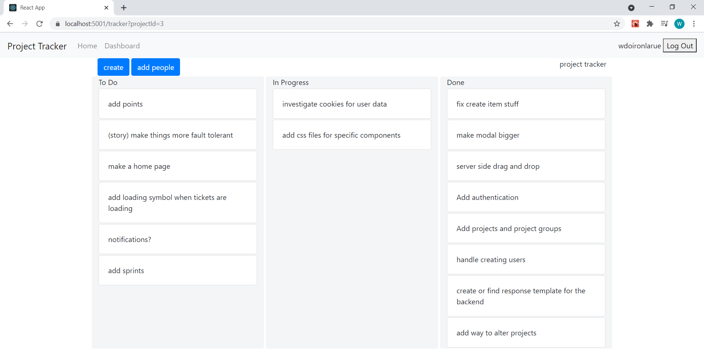

# project tracker

Project Tracker is a web application that can be used to track the progress of projects.
It allows users to login, create projects, create issue "tickets" within those projects, edit and delete the projects and issues, and add other users to their projects.

Authorization and authentication is implemented using Auth0 React SDK.

ASP.NET Core is used for the web framework with C# for the backend and React as the Javascript framework.
It uses Entity Framework core as an Object-Relational Mapping tool to interact with and manage the database.

The frontend is a single page application built based off of a create-react-app project.
Uses bootstrap for a lot of general CSS to create a responsive UI.

The project consists of three main pages:
## Homepage
Entry point for the application. 
Displays some text describing Project Tracker and how to use it. 
Only page that can be accessed without being logged in. 
 
 

 

## Dashboard
Contains a list of projects that the user has created, or has access to via being added by another user.
Allows the user to view details of the project as well as to create new ones and edit existing projects.
 
 

## Tracker Page
This page contains the actual tracker that helps keep track of issues and tasks.  
It allows users to create, edit, and delete issues, and add people to the project. 
A user can click on the issue "tickets" to open the edit modal where they can view more detailed info about the issue and make any changes that they want.
They can also drag and drop an issue from one column to the next in order to track the progress of each individual task.
 
 

